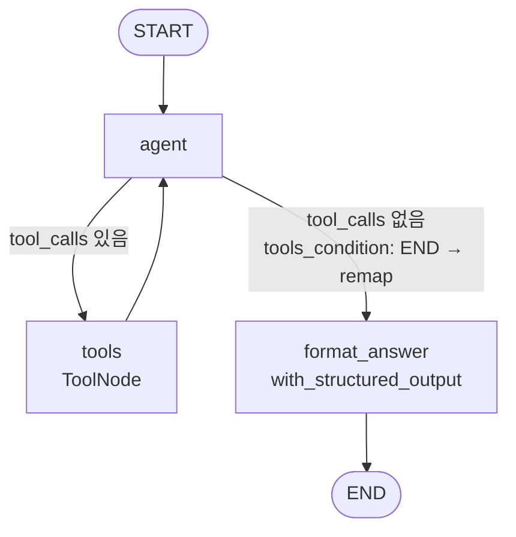

# Week 1 — 알고리즘 도메인 ReAct Agent

`StateGraph` + `langgraph.prebuilt.ToolNode` / `tools_condition` 으로 구성한 ReAct loop 
코딩 테스트 학습 코치


## 도메인과 도구

코딩 테스트 준비 중 흔한 질문 3가지에 1:1 매핑

| 도구 | 용도 |
|---|---|
| `get_algorithm_pattern(name)` | 패턴 설명/시간복잡도/템플릿 |
| `recommend_problems(topic, level, problem_id)` | 프로그래머스 문제 추천/조회 |
| `review_solution(problem_id, user_code)` | 풀이 리뷰용 reference rubric |

`review_solution` 은 코드를 직접 채점하지 않고 **rubric만 반환** — LLM이 rubric vs user_code 비교를 자연어로 수행. 결정론적 retrieval과 LLM generation 분리 (RAG 결의 패턴).

## 그래프



- `agent` — `bind_tools` 된 LLM 호출
- `tools` — 강의 06번대로 `ToolNode(tools)` 사용
- 분기 — `tools_condition` 의 `END` 출구를 `format_answer` 로 remap
- `format_answer` — `with_structured_output(ReActAnswer)` 로 정규화

## 응답 스키마

```python
class ReActAnswer(BaseModel):
    answer: str          # 한국어 마크다운
    used_tools: list[str]
    sources: list[str]   # 'pgs-43238', 'binary-search' 등
    confidence: float    # 0.0~1.0
```

심화 요구사항 (`근거 / 사용한 도구 / confidence`) 포함.

## 실행

```bash
uv sync
uv run jupyter lab
# assignments/pykido/week1/algorithm_react_agent.ipynb 열고 위에서부터 실행
```

`.env` 에 `OPENAI_API_KEY` 만 있어서 모델은 `openai:gpt-4.1-mini`. `ANTHROPIC_API_KEY` 있으면 노트북의 `init_chat_model` 인자만 `claude-sonnet-4-5` 로 교체.

## 테스트 결과

| # | 유형 | 호출된 도구 | 결과 |
|---|---|---|---|
| 1 | 개념 정리 | `get_algorithm_pattern("binary-search")` | 템플릿+실수 정리 |
| 2 | 문제 추천 | `recommend_problems(topic="binary-search", level="Lv.3")` | `pgs-43238 입국심사` |
| 3 | **풀이 리뷰** — TLE 나는 brute-force 코드 | `review_solution("pgs-43238", <user_code>)` | brute-force `O(max_t × M)` → 이분 탐색 `O(M log(...))` 정답 코드 제시 |
| 4 | 다단계 | `get_algorithm_pattern` + `recommend_problems` 병렬 | 슬라이딩 윈도우 설명 + `pgs-67258 보석 쇼핑` 통합 |

Q3 가 도메인 가치 가장 잘 보여주는 케이스 — agent 가 rubric 의 `reference_complexity` 와 사용자 코드의 실제 복잡도를 비교해서 정확한 개선점을 짚어냄.

## Mock 데이터

- `PROBLEMS`: 프로그래머스 6문제 (`pgs-43238`, `pgs-43236`, `pgs-43165`, `pgs-118667`, `pgs-67258`, `pgs-42898`) — 각 문제에 `reference_approach` / `reference_complexity` / `key_checkpoints` / `common_pitfalls` 박혀 있음 (review_solution rubric 소스)
- `PATTERNS`: 5개 (`binary-search`, `sliding-window`, `two-pointers`, `bfs-dfs`, `dp`)

## 한계 / 다음 주(2주차)에 보강하면 좋을 내용들

- **stateless** — 이전 질문 맥락 못 이음 → 2주차 `InMemorySaver` + `thread_id`
- **풀이 리뷰가 정성적** — 코드 실행/정적 분석 X. 5주차 tool 확장 시 `code_runner` 같은 도구로 보강 가능
- **mock DB 6문제** — 실서비스로 가려면 프로그래머스 검색 API/크롤링 필요
- **`format_answer` 가 LLM 호출 1회 추가** — structured output을 `agent` 노드에 통합하는 패턴 후속 주차에서 재설계
